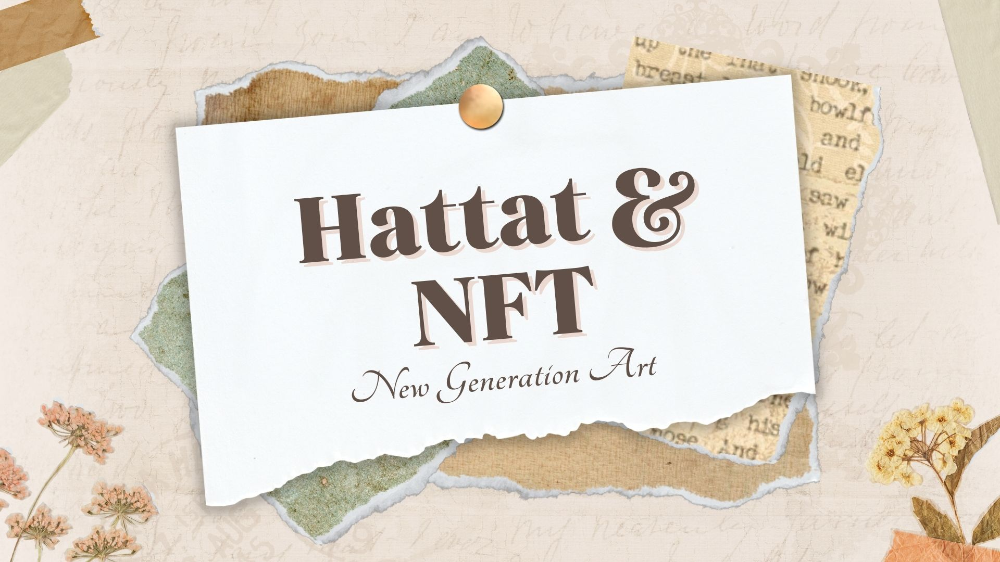

# HattatWeb

> Bu projeyi gelenekselleşmiş hattat sanatını web2'ya uyarlamak için yaptık, projenin amacı geleneği geleceğe taşımak.
> Proje web3 projesi olarak yapılmaya başlandı hatta cüzdan bağlantısı kısmı bile var fakat web3 kısmı (açık kaynak kodlarda da görüldüğü gibi) tamamlanmadı. Şimdilik web3'ye dair hiçbir özellik taşımamaktadır.

> Canlı Proje [_tıkla_](https://hattat3.vercel.app/#about).

## İçerik
- [HattatWeb](#hattatweb)
  - [İçerik](#i̇çerik)
  - [Genel Bilgi](#genel-bilgi)
  - [Kullanılan Teknolojiler](#kullanılan-teknolojiler)
  - [Features](#features)
  - [Projeye Bakış](#projeye-bakış)
  - [Proje Durumu](#proje-durumu)
  - [Bilgilendirme](#bilgilendirme)
  - [İletişim](#i̇letişim)
  - [License](#license)

## Genel Bilgi
Projeyi klonladıktan sonra live server kullanarak localinizde çalıştırabilirsiniz.

## Kullanılan Teknolojiler
- HTML
- CSS
- JavaScript
- PHP

## Features
- İsteğe ve açılan issue'lere bağlı olarak features eklenecektir. Proje bitmiştir, kar amacı söz konusu değildir.

## Projeye Bakış

## Proje Durumu
Proje bitti.

## Bilgilendirme
- Bu proje geleneği geleceğe taşımak adı altında kar amacı taşımadan oluşturulmuştur

## İletişim
[Twitter - @busenurcetin16](https://twitter.com/busenurcetin16) tarafından projenin arayüzü yapıldı.

## License 
Bu proje GNU General Public lisansı altında açık kaynak olarak paylaşılmıştır.
